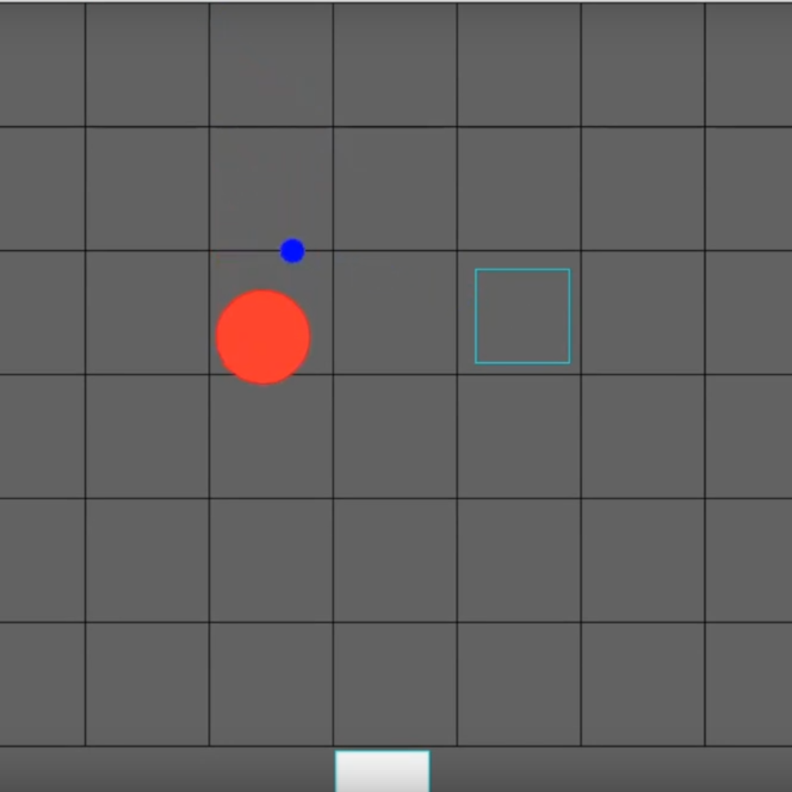

<div class="text-center p-4">
  
</div>

## Overview

As part of my AP Computer Science Principles course, we had to make a few projects over the course of the year. This one was my final, in which I made a prototype tower defense game utilizing Processing. The map consists of a grid, and you can move your player character to any one of the squares. Enemies would come in a fixed path, and the character would shoot projectiles at them until their HP reached 0. To place your character, you could select it from the available roster and then click on the space you want them to go. If you changed your mind, you can click any space in the lower roster bar to cancel your selection.

## Role and Responsibilities

I created this project mostly on my own for my final, with some help from the teacher. We were to submit the final code as well as a screencast explaining the purpose of important chunks of code in our program.

## The Takeaways

This was my introduction to more complex Java objects and classes. The map was built with a 2d array of objects. It also taught me the virtues of patience; this was probably one of the most frustrating projects I’ve ever worked on, and I ran into many, many hurdles along the way. But with some careful review and a second look from a friend, problems can eventually be solved. Here’s a short excerpt of code that determines if a projectile has hit an enemy:

```cpp
boolean hit(MapObject enemy, Projectile projectile) { //boolean to determine if a projectile has collided with an enemy
   boolean collided; //boolean to report collisions 
   float enemyDistance = sqrt(sq(enemy.xPos - projectile.projXPos) + sq(enemy.yPos - projectile.projYPos)); //calculates distance from projectile 
   if (enemyDistance < enemyDiameter/2 + diameter/2) { //big radius + small radius 
     enemyHP = enemyHP - 1; //decrease enemy HP by one upon hit  
     collided = true; //projectile and enemy have collided 
   } else { 
     collided = false; //no collision has occurred otherwise 
   } 
 return collided; //returns the value of collided 
 } 
```
