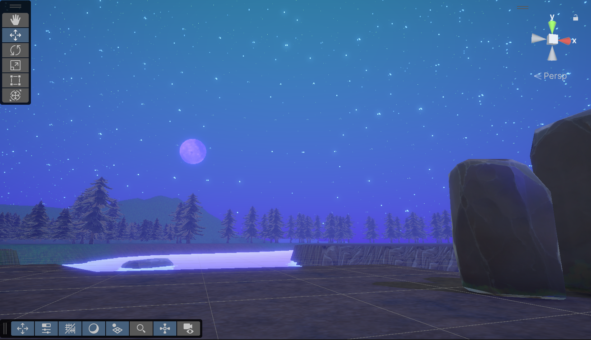

  

<video src="../video/ics685_proj2_prev.mp4" controls="controls" style="max-width: 730px;">

## Overview

A Unity-based puzzle game where you take the role of the Big Bad Wolf from The Three Little Pigs and attempt to use your breath to solve puzzles and enter the pigs' homes. For example

## Role and Responsibilities

Though technically a group project, I ended up programming the overwhelming majority of it. This included shader creation (particularly the skybox and water), event management, breath force logic using Unity's physics system, animation, visuals and postproessing, and the UI, among other things. Assets were found from the Unity Asset Store and Sketchfab, though I also edited a few to suit our needs.

## The Takeaways

I delved more into Unity's Shadergraph with this project, referencing tutorials to create the water and sky shaders. For the water, a Fresnel node was added to make the water more reflective when viewed from certain angles, and it supported UV distortion to mimic the refraction present in real-life water.
