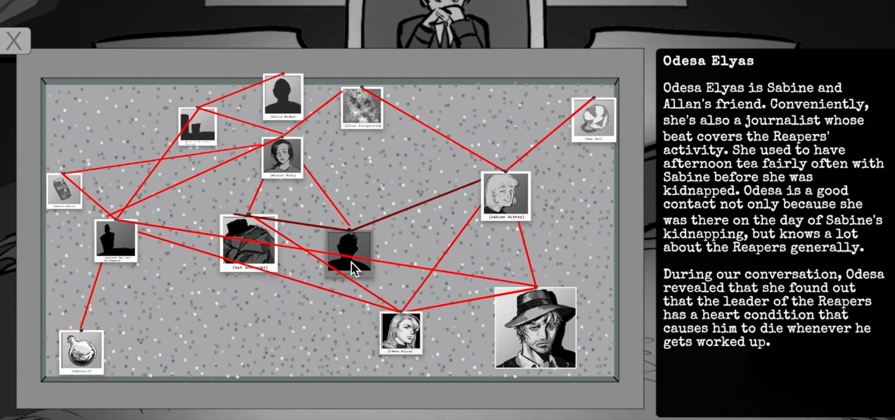

<video src="https://github.com/user-attachments/assets/e6b256d6-60c7-4918-b8a7-2ecb6354eea0" width="1280" height="720" controls="controls"></video>

## Overview

A Unity-based, 2D visual novel in which you play as the titular detective Estelle Margaux, attempting to exonerate her friend Allen Ritter. The game takes place in a fantasy setting where all characters have passed into the afterlife, and the world you interact with is a representation of the afterlife (hence the film noir, black and white aesthetic). The player has the ability to peer into the souls of the deceased and enter their memories, denoted by a specific color, to search for clues and flaws in their testimony. There is also an interrogation system.

  

## Role and Responsibilities

This project was created in a team of three over the course of two months. I programmed everything and contributed some of the assets, namely the characters' icons during dialogue and pictures used in the UI. Much of the work involved setting up a custom-built dialogue system that supported Ink, a third-party text editing software. I took creative direction with the UI layout, using typewriter-esque fonts and representing menus as pinboards with red strings between items to maintain immersion with the film noir setting. I also took on project management responsibilities, i.e. checking in with teammates' weekly progress and utilizing GitHub's project system. 

## The Takeaways

This was my introduction to using 2D with Unity, as well as creating tools to support third-party software in Unity. I also expanded my design knowledge by making creative menus that fit our overall theme.
